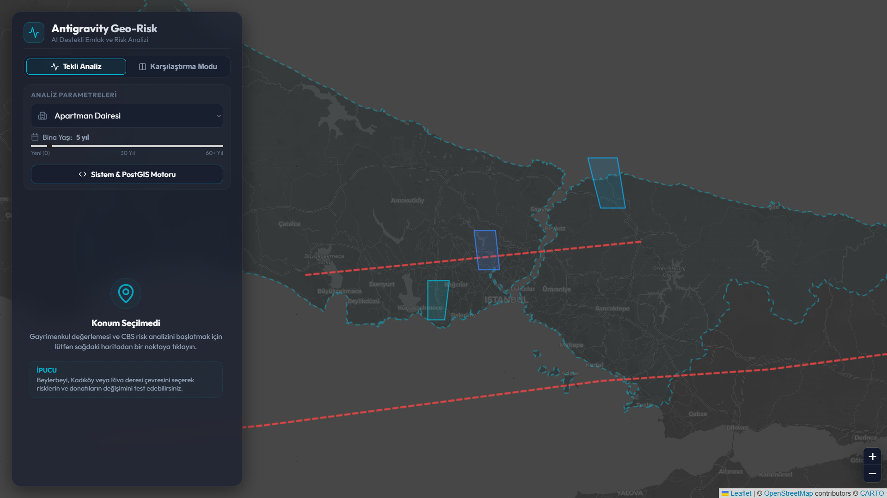
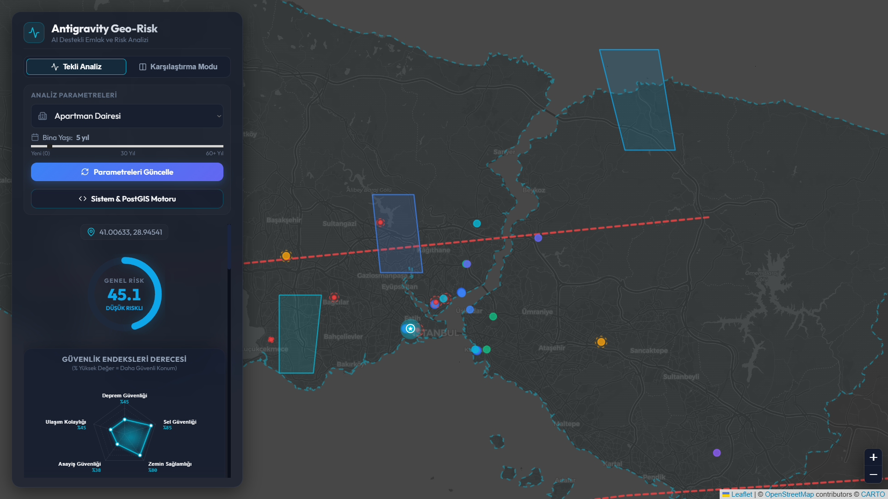
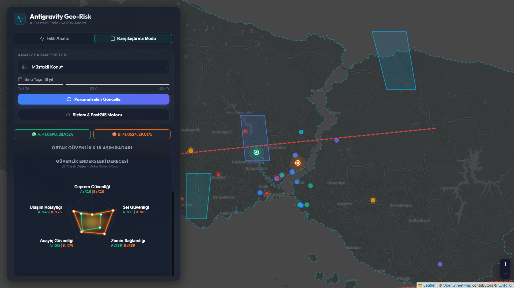
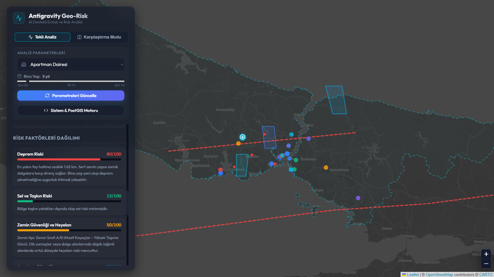
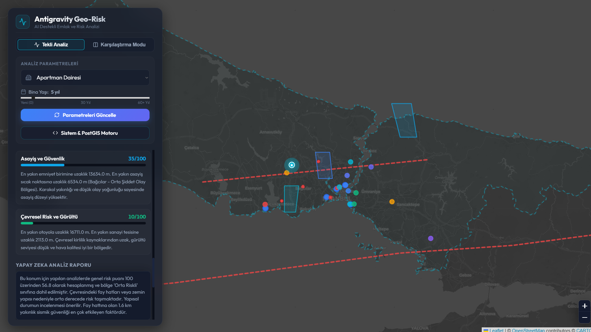
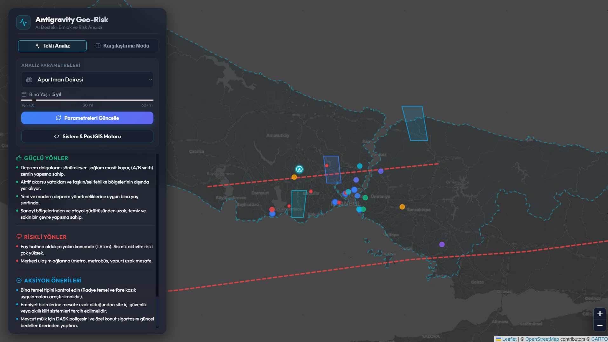

# 🌍 Antigravity Geo-Risk Analyzer













## 🚀 Overview

Antigravity Geo-Risk Analyzer is an AI-powered WebGIS platform that evaluates earthquake, flood, soil and environmental risks for real estate locations.

The project combines modern GIS technologies, spatial databases and intelligent risk reporting to provide location-based analysis and decision support.

---

## ✨ Key Features

* Interactive map-based risk analysis
* Earthquake proximity assessment
* Flood zone detection
* Soil quality evaluation
* Transportation accessibility scoring
* Security and environmental analysis
* AI-generated risk reports
* Real estate valuation support
* Spatial database analytics
* Graceful fallback simulation mode

---

## 🏗️ System Architecture

```text
Leaflet Map
    ↓
React Frontend
    ↓
FastAPI REST API
    ↓
Pydantic Validation
    ↓
SQLAlchemy / GeoAlchemy2
    ↓
PostgreSQL + PostGIS
    ↓
Spatial Analysis Engine
    ↓
AI Risk Engine
    ↓
AI Report Generator
    ↓
JSON Response
    ↓
React User Interface
```

---

## 🛠️ Technology Stack

### Frontend

* React
* Vite
* Leaflet

### Backend

* FastAPI
* Pydantic
* SQLAlchemy
* GeoAlchemy2

### Database

* PostgreSQL
* PostGIS

### GIS & Spatial Analytics

* ST_Distance
* ST_Contains
* ST_Transform
* KNN Search
* GiST Index
* R-Tree Indexing

### Fallback GIS Engine

* Shapely
* Haversine

### Infrastructure

* Docker
* Docker Compose

---

## 📊 Spatial Operations

### ST_Distance

Calculates distances between spatial geometries.

### ST_Contains

Determines whether a location exists inside a polygon such as a flood zone.

### ST_Transform

Converts coordinate systems between SRID 4326 and SRID 3857 for accurate metric calculations.

### KNN Search

Finds nearest spatial objects efficiently using GiST indexes.

### GiST + R-Tree Indexing

Accelerates spatial searches by organizing geometries using Minimum Bounding Rectangles (MBR).

---

## 🔌 Graceful Fallback Mode

Unlike traditional GIS applications, the system continues operating even when PostgreSQL/PostGIS becomes unavailable.

When a database connection cannot be established:

* Shapely performs geometric calculations
* Haversine calculates geodesic distances
* Risk analysis continues without interruption

This ensures uninterrupted service and prevents complete application failure.

---

## 🚀 Running with Docker

```bash
docker-compose up --build
```

Frontend:

```text
http://localhost:5174
```

Backend:

```text
http://localhost:8081
```

---

## 📈 Future Improvements

* Integration with AFAD earthquake datasets
* Integration with Istanbul Metropolitan Municipality (IBB) GIS datasets
* Nationwide coverage beyond Istanbul
* Real-time GIS data ingestion
* Machine learning based valuation models
* Cloud deployment and scalability improvements

---

## 👨‍💻 Author

**Ahmet Akdeniz**

Computer Engineering Graduate

FastAPI • React • PostgreSQL • PostGIS • GIS • Docker • Spatial Databases • AI-Assisted Analytics
